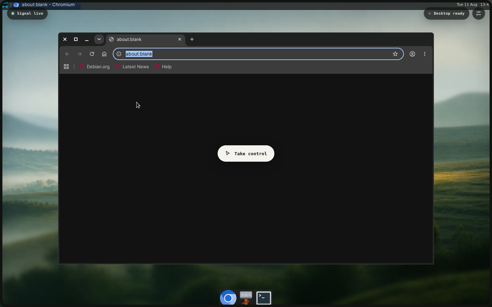

# Relay AI Desktop

One Linux desktop, shared by a human and an AI operator.



Relay packages a complete XFCE desktop into one Docker container and streams it
to the browser. An AI can inspect and operate that same 1440×900 session through
a bounded API; a human can take over instantly, work with the real keyboard and
pointer, then hand the session back without reconnecting or losing application
state.

It is built for live demos of web, Linux, and Electron applications where the
audience needs to see what the agent sees—and step in when judgment matters.

## What works today

- A real Debian 12 + XFCE desktop rendered by Xvfb and streamed through noVNC.
- Shared viewing with explicit AI/human control leases and immediate human
  preemption.
- A real OS cursor baked into the stream, including while the browser is in
  observer mode.
- Hybrid agent grounding: bounded AT-SPI accessibility snapshots plus PNG
  screenshots for visual or canvas-based interfaces.
- Validated XTEST mouse and keyboard input; no arbitrary shell endpoint.
- Chromium, Terminal, and Files included, with guarded APT or local `.deb`
  installation for runtime apps such as Electron packages.
- Persistent home and approved-install state across normal container recreation.
- An in-container `os-operator` skill and `relayctl.py` client for AI agents.

## Quick start

You need Docker Engine with Compose and roughly 2.5 GB of image space.

```bash
git clone https://github.com/jahrulnr/virtual-desktop.git
cd virtual-desktop
docker compose up -d --build
```

Open <http://127.0.0.1:3000>, enter the local VNC password `testtest`, and click
**Open desktop**. The browser begins in observer mode; click **Take control** only
when you want keyboard and pointer events to enter the desktop.

The included credentials—`testtest` for VNC and `test-control-token` for the AI
control API—are predictable development fixtures. The port is deliberately bound
to loopback. Before any non-disposable or remotely reachable run, override both:

```bash
VNC_PASSWORD='replace-with-at-least-8-characters' \
CONTROL_TOKEN='replace-with-at-least-32-random-characters' \
docker compose up -d --build
```

Relay rejects a VNC password shorter than 8 characters and an operator token
shorter than 12. Neither value is printed in the container logs.

## Control handoff

Every viewer sees the same framebuffer, windows, and OS cursor. The control model
changes who may send input, not which desktop they are connected to.

1. The browser opens view-only behind a transparent input shield. Its ordinary
   browser cursor remains visible and cannot accidentally reach noVNC.
2. An AI claims a short lease and sends bounded input through the control API.
3. Clicking **Take control** preempts that AI lease, removes the shield, and lets
   noVNC capture the human pointer and keyboard.
4. Clicking **Release control** returns the browser to observer mode. The AI can
   claim a fresh lease and continue from the exact same screen.

Human claims always win. A preempted agent receives HTTP 409 on its next heartbeat
or input request, so a well-behaved operator stops immediately.

## Operating the desktop with an AI

The image installs the agent skill at
`/home/desktop/.agents/skills/os-operator`. Its helper wraps lease management,
screenshots, accessibility, input, and approved installs:

```bash
docker compose exec -T desktop sh -lc '
  export RELAY_OPERATOR_TOKEN="$(cat /run/ai-desktop/operator-token)"
  cd /home/desktop/.agents/skills/os-operator
  python3 scripts/relayctl.py status
  python3 scripts/relayctl.py accessibility
  python3 scripts/relayctl.py claim --agent-id demo
  python3 scripts/relayctl.py input --agent-id demo --actions '\''[
    {"type":"move","x":420,"y":260},
    {"type":"click","button":"left"}
  ]'\''
  python3 scripts/relayctl.py release --agent-id demo
'
```

The intended operating loop is accessibility-first, vision as fallback, then a
small action batch followed by observation. Coordinates always refer to the
1440×900 framebuffer, not the browser-scaled canvas. The full wire contract is in
[the API reference](docs/API.md).

## Installing desktop and Electron apps

The agent cannot approve its own package installation. A human opens the desktop
controls, approves an exact APT package list or a `.deb` already located under
`/home/desktop/Downloads`, then gives the short-lived approval ID to the operator.
The approval is single-use, expires after two minutes, and—for local packages—is
bound to the file's SHA-256 digest.

Successful install plans are recorded in a root-owned volume and replayed when a
fresh container is created. This makes demo machines convenient without turning
the control API into a root shell.

## Persistence and reset

`docker compose down` preserves the desktop home directory, browser profile,
Downloads, user-local applications, and approved-install manifest. Bring the same
session back with `docker compose up -d`.

To deliberately erase both named volumes:

```bash
docker compose down -v
docker compose up -d --build
```

## Architecture at a glance

```text
browser ── noVNC/WebSocket ──┐
                             ├── Xvfb :0 + XFCE + desktop apps
AI client ── bounded API ────┘          │
       │                                └── persistent /home/desktop
       └── human-approved plan ── root install broker
```

Nginx exposes one loopback origin. x11vnc and the AI input adapter talk to the
same X11 display, while a server-side lease arbitrates control. Desktop apps run
as UID 1000, the control API as UID 1001, and only the narrow install broker runs
privileged package operations. Read [the architecture](docs/ARCHITECTURE.md) for
the tradeoffs against KasmVNC and WebRTC/Selkies.

## Validate a change

```bash
make test       # unit and API behavior
make static     # unit, syntax, Compose, skill, and security invariants
make smoke      # live framebuffer, AT-SPI, input, and handoff checks
```

The manual two-controller walkthrough is in [docs/TESTING.md](docs/TESTING.md).

## Documentation

- [Architecture and design decisions](docs/ARCHITECTURE.md)
- [Operator and handoff API](docs/API.md)
- [Security boundary and hardening](docs/SECURITY.md)
- [Testing and manual control handoff](docs/TESTING.md)
- [Implementation specification](docs/SPEC.md)
- [Contributing](CONTRIBUTING.md)

## Security status

Relay is a local, single-user demo environment—not a hostile multi-tenant sandbox.
The reference Compose setup uses `seccomp=unconfined` so Chromium and Electron can
retain their own namespace sandbox inside Docker. That still broadens the host
kernel attack surface. Do not expose this container directly to a network; add
authentication, TLS, egress controls, resource limits, and a stronger runtime
boundary first. See [SECURITY.md](docs/SECURITY.md) before deployment.

No open-source license has been selected yet. Until one is added, normal copyright
rules apply; contributions are welcome for review but do not imply a license grant.
